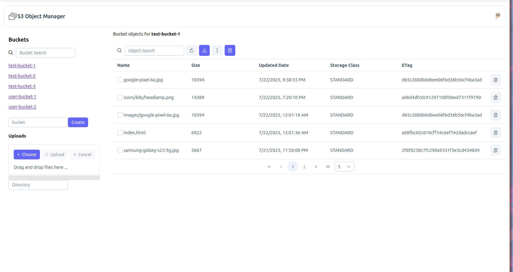

# s3-object-manager
S3 Object Manager - A ui for accessing AWS S3 buckets service

## Description
A web ui for accessing AWS S3 service and managing objects

### Features
- List Buckets
- List Objects
- Create Buckets
- Upload Objects (even supplying a directory which will be auto created, multi object upload supported)
- Show status bar during uploads
- Download Objects (supports multi object download)
- Delete Buckets
- Delete Objects (supports multi object delete)
- Search/filter buckets/objects
- Generate presigned urls for file/object sharing
- Authentication flow/ui allowing auth with custom auth_key and auth_secret.

## Screenshot


## Dependencies
nodejs v22.17 or later

## Installation 
install nodejs LTS and do
`export PATH=/opt/node-v22.17.1-linux-x64/bin:$PATH`
That is the version I developed on.

## Run with nginx
Add your S3 endpoint to .env.production file

```
npm install 
npm run build
```
Then host the generated contents of dist file with nginx.

## Build custom docker image
Add your S3 endpoint to .env.production file

```
rm -rf dist
npm install
npm run build
cd docker
./build-image.sh

docker run -p 5000:80 -d --name s3-object-manager s3-manager:latest
```

## Development
Add your S3 endpoint to .env.development file

```
npm install
npm run dev
```
Then access from your local browser

## Tech stack
- node js
- vue 3
- AWS S3 Javascripts sdk v3

## Special notes
Tested with minio docker image: minio/minio:RELEASE.2025-04-22T22-12-26Z.

When using with AWS you need to configure proper CORS config on your S3 bucket else you will get the following browser error:

`Cross-Origin Request Blocked: The Same Origin Policy disallows reading the remote resource at https://s3.us-east-1.amazonaws.com/?x-id=ListBuckets. (Reason: CORS header ‘Access-Control-Allow-Origin’ missing). Status code: 403.`

You need to add CORS config to allow requests from your domain on the S3 bucket.

## Support
You can buy me a coffee if you like this software

<a href="https://www.buymeacoffee.com/mtseet" target="_blank"></a>